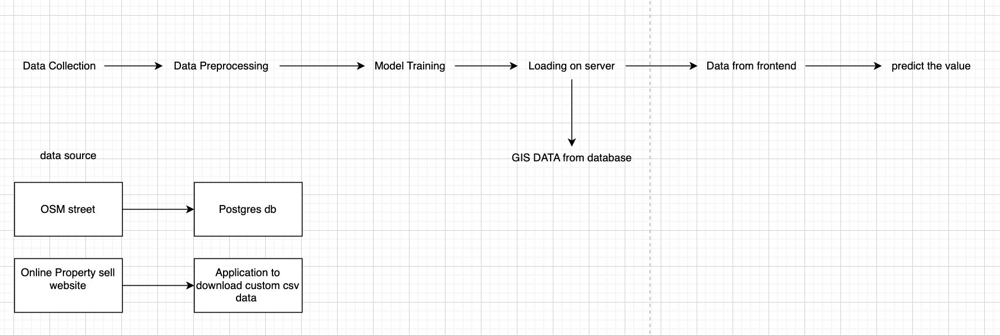
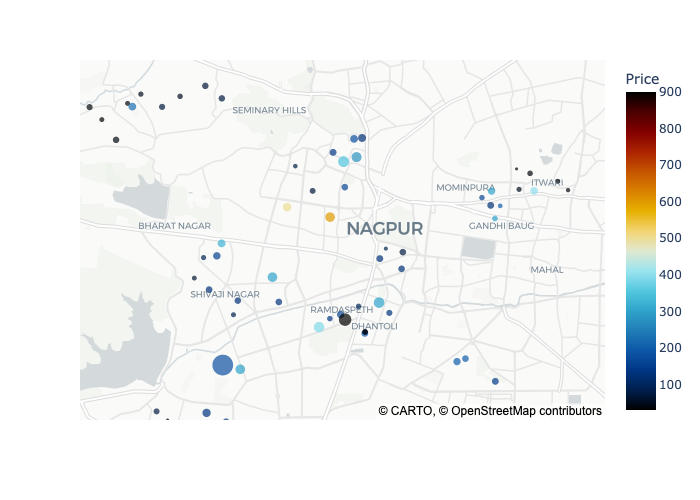

# Estimate_PLOT_PRICE Using GIS DATA and Machine Learning
Section added
1. PostgresSql Setup for osm data
2. Data scraping from Google Map 
3. Datasets gathered
4. Data Integration
5. Data Preprocessing

Basic Flow of Project:
</img>

Map Representation of Dataset
</img>